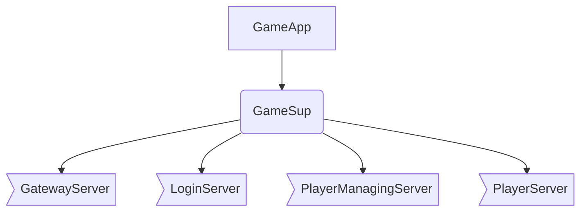

# go-rigger
## 关于go-rigger
go-rigger基于actor框架[protoactor-go](https://github.com/AsynkronIT/protoactor-go),[官网地址](https://proto.actor)  
go-rigger对protoactor-go进行了轻度包装,以使框架更符合Erlang开发者的习惯
同时go-rigger配置化了应用的启动,使得应用在开发时可以在单节点上运行,以方便调试,而在发布时又可以根据配置将应用中的各个进程分布到不同的节点上去运行
## 安装
```shell script
go get github.com/saintEvol/go-rigger
```

## 相关术语
+ Actor模型 一种并发模型, 与共享内存模型相反, Actor模型不共享任何数据, 所有实体间通过消息来进行合作,交互, 原生支持Actor模型的典型语言是Erlang,
  关于此模型的更多信息, 请自行了解
+ Actor Actor模型中的关键概念, actor是Actor模型中的运行实体, actor拥有自己的状态,资源和行为; actor之间通过消息互相协作,
  因为actor在行为上和系统进程很相似,因此有些语言也将Actor称之为 进程, 本说明中后续也将延续此命名

+ Application 一种进程的类型, 此类型的进程被称之为应用进程, 是go-rigger程序的根节点, 每个go-rigger程序至少包含一个应用进程

+ Supervisor 一种进程的类型, 此类型的进程被称之为监控进程, 此类型的进程, 主要用于对其它进程(子进程)进行监控,并根据一定的策略,在子进程异常终止时,对其进行重启等操作;
  一般不(建议)在此类进程中进行任何与业务相关的逻辑
+ GeneralServer 一种进程的类型, 此类型的进程被称为通用服务器进程, 此类型的进程, 主要用于执行各类业务逻辑, 其往往是某个 Supervisor进程的子进程

## 如何使用本框架

go-rigger程序的开发往往开始于一张应用的进程规划图,比如, 想要开发一款在线游戏, 也许,我们脑海里首先想到的是:
+ 我需要一个进程来处理来自客户端的连接, 也许可以命名为: ```GatewayServer```
+ 还需要一个进程来处理玩家的登录请求: ```LoginServer```
+ 对于成功登录的每个玩家, 如果我能用一个单独的进程来维护其运行时状态及行为, 事情应该会简单很多, 所以每个玩家我们需要一个进程: ```PlayerServer```
+ 不同的玩家可能会有一些并发操作, 比如: 创建用户时, 需要生成一个全局的用户ID, 这个ID显然不能由各个用户进程各自生成(除非采用某种UUID算法),
  因此我应该需要一个统一的进程来处理这些操作, 以便将临界操作顺序化, 不妨将这个进程命名为: ```PlayerManagingServer```
+ 当然, 根据之前的说法,每个rigger-go程序应该至少包含一个Application进程, 所以我们再增加一个```GameApp```
+ 为了能够在运行时监测各个进程的状态, 并在各进程异常退出时对其进行重启, 我们还需要一个监控进程, 命名为: ```GameSup```
现在, 我们的游戏的进程树应该如下所示:



当我们有了关于进程树的规划后,就可以开始着手编码了:

下面我们实现进程树中各个进程, 请注意,go-rigger中各个类型的进程的自定义逻辑不是通过实现如: Appication, Supervisor, GeneralServer等接口来实现的(实际上也不存在这些接口)
相反, go-rigger提供了对应的行为模式接口来供用户自定义逻辑, 分别是: ```ApplicationBehaviour```, ```SupervisorBehaviour``` 与 ```GeneralServerBehaviour```

```go

```

